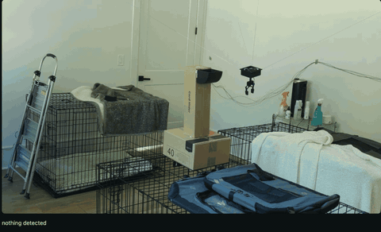

# petbot — a cable-driven parallel robot for pet monitoring

A ceiling-cabled robot that positions a camera and treat-dispensing claw
anywhere in a room. Four winches at floor level pull braided line over
corner-mounted pulleys to a moving platform. A fixed Raspberry Pi runs
detection and issues coordinates; an Arduino solves the inverse kinematics
and drives the winches; an ESP32 on the platform actuates the claw.

Built in two weeks, from first stepper on a breadboard to a working
delivery sequence.

## Demo

[](docs/media/demo.mp4)

The GIF is the full run at 8× speed. Click it for the
[real-time MP4](docs/media/demo.mp4) (2 min 49 s), recorded from the
browser feed in `vision/`.

---

## What it does

Type a coordinate in millimetres, and the platform goes there. From a
browser you can send it to a treat bowl, close the claw, lift, traverse
to a crate, and release — while watching a live YOLO-annotated video
feed of the room.

## How it works

Four cables, four winches, three degrees of freedom. To move the platform
toward one corner, that corner's winch reels in while the opposite one
pays out. Cable lengths encode position.

```
      winch 4 ┌──────────────────────┐ winch 1
    (0, 4343) │                      │ (3632, 4343)
              │      ╲          ╱    │
              │        ╲      ╱      │
              │          ▣          │   ▣ = platform
              │        ╱      ╲      │
              │      ╱          ╲    │
    (0, 0)    │                      │ (3632, 0)
      winch 3 └──────────────────────┘ winch 2

  pulleys at 2794 mm; winches at floor level, line runs up the corner
```

Inverse kinematics is one distance calculation per cable. For platform
position **P** and anchor *i* at **A**ᵢ:

```
Lᵢ = ‖P − Aᵢ‖ = √((x−xᵢ)² + (y−yᵢ)² + (z−zᵢ)²)
stepsᵢ = Lᵢ × steps_per_mm
```

Forward kinematics is over-constrained and not solved here. `MultiStepper`
scales each motor's speed so all four arrive simultaneously, which is what
makes the platform travel in a straight line rather than an arc.

The fixed run from each winch up to its pulley never spools, so it drops
out of the maths entirely — it folds into the homing offset.

## Architecture

```
  Raspberry Pi 5  ── USB serial ──►  Arduino Uno  ──►  4× TMC2209  ──►  4× NEMA 17
   ArduCam IMX708                     IK + MultiStepper
   YOLOv8n
   Flask control UI
        │
        └────────── WiFi ──────────►  ESP32 (on platform)
                                       SG90 claw servo
                                       SSD1306 face display
```

The Pi is the only component that makes decisions. The Arduino executes
coordinates; the ESP32 executes claw commands. Neither knows the other exists.

---

## Repo layout

| Path | Contents |
|---|---|
| `firmware/` | Arduino sketch — IK, MultiStepper coordination, serial protocol |
| `esp32/` | Platform node — WiFi server, claw servo, OLED face, OTA updates |
| `vision/` | Camera capture, YOLO detection, Flask stream |
| `control/` | Serial wrapper and mission sequencing |
| `cad/` | Spools, pulley housings, motor brackets, platform |
| `docs/` | Kinematics, calibration procedures, build log, results |
| `control.py` | Flask control page: live feed, moves, claw, delivery sequence |
| `platformio.ini` | Build/upload envs for both boards (`uno`, `esp32`, `esp32_usb`) |
| `archive/` | Pre-hardware scaffold sketches, kept for reference only |

## Serial protocol

The Arduino accepts single-character commands at 115200 baud:

| Command | Effect |
|---|---|
| `M x y z` | Move to coordinate (blocking) |
| `R` | Report current position |
| `H x y z` | Declare the platform's actual position |
| `D` / `E` | Disable / enable motors |

`H` is the homing mechanism. There are no limit switches — the operator
places the platform at a known point and tells the firmware where it is.

---

## Measured results

### Spool payout variation

Effective drum radius changes as line layers build, so `steps_per_mm` is
not constant. Measured on the original 15.6 mm core drum, 11 samples at one
fill level:

```
mm per revolution: 53.98, 60.33, 58.74, 58.74, 58.74, 57.15,
                   55.56, 53.98, 52.39, 58.74, 55.56

mean  56.7 mm/rev
range 52.4 – 60.3 mm/rev  (±3.5%)
```

Across the full drum range the variation was far worse — payout measured
100.3 mm/rev with the drum full against 56.7 mm/rev near empty, a 44%
difference, because each added layer of 1.5 mm line increases effective
diameter by 3 mm on a 15.6 mm core.

Redesigning to a **40 mm core** cut per-layer diameter change from 19% to
7.5%. Post-redesign calibration: 16000 steps paid out 1524 mm, giving
`steps_per_mm = 10.5`.

**Consequence:** at 2 m of paid-out cable, the residual ±3.5% amounts to
roughly ±70 mm of position uncertainty.

### Workspace

Cables pull; they cannot push. Every cable's tension must stay positive,
which bounds the reachable volume well inside the anchor footprint.

Measured: with anchors spanning 3632 × 4343 mm, the cable from winch 2
went slack at **y ≈ 3494 mm** — about 80% of the way along that axis.
Positions near the midpoint of a wall are unreachable at any useful height,
because the near anchors end up nearly collinear and no combination of
positive tensions holds the platform there.

Working positions used in the demo, all verified taut:

| Waypoint | x | y | z |
|---|---|---|---|
| Park | 1500 | 1750 | 2400 |
| Treat bowl | 1500 | 1750 | 1800 |
| Dog crate | 2400 | 2200 | 1600 |

(z is the cable attachment plane; the claw hangs 140 mm below it.)

---

## Known limitations

These are real, measured, and unresolved. Listing them is more useful than
pretending otherwise.

**Open-loop steppers.** Skipped steps are silent. The driver keeps counting
pulses that produced no rotation, so commanded and actual cable length
diverge permanently until re-homed. No encoder feedback is implemented.

**Variable spool radius.** Documented above. A single `steps_per_mm`
constant cannot represent a drum whose effective radius depends on how much
line is wound on it. The fix is either single-layer winding (needs a wider
drum than a NEMA 17 shaft comfortably cantilevers) or modelling radius as a
function of paid-out length.

**Manual homing.** No limit switches. The operator positions the platform
and issues `H x y z`. Every subsequent move inherits whatever error is in
that measurement.

**Anchor coordinates measured by tape.** Error here is systematic and
propagates into position error everywhere in the workspace. It cannot be
calibrated out without remeasuring.

**Cable exit point migrates.** The point where line leaves the pulley sheave
shifts by up to ±15 mm as platform position changes. Not modelled.

**Claw power.** The SG90 completes its full range on a 3.7 V LiPo through a
TP4056, but the current surge collapses the rail and resets the ESP32 —
tested with 100 µF, 470 µF and 1470 µF of bulk capacitance, and with both
step-ramped and single-write servo commands. Root cause is insufficient
current capability in the LiPo/TP4056 output path. Resolved for the demo by
powering the ESP32 from a regulated 5 V USB bank; the proper fix is a boost
converter.

**No mid-move abort.** `runSpeedToPosition()` blocks, so a move cannot be
interrupted once started. Disabling the motors de-energises the drivers and
drops the platform — it is a last resort, not a brake.

**Adhesive anchors.** Corner pulleys are mounted with 3M VHB rather than
mechanical fasteners, at the cost of a permanent installation. One pulley
detached during testing. A slack safety tether is required at all times.

---

## Bill of materials

| Item | Qty | Notes |
|---|---|---|
| NEMA 17 stepper (17HS19-2004S) | 4 | |
| BigTreeTech TMC2209 v1.2 | 4 | standalone, 1/8 microstep, VREF ≈ 1.10 V |
| Arduino Uno | 1 | |
| 12 V PSU, 10 A | 1 | |
| Inline 5 A blade fuse | 1 | added after a VM/GND reversal cooked a wire |
| 100 µF electrolytic | 4 | one per driver, at its VM/GND pins |
| U-groove 608 bearing | 4 | 30 mm OD, 8 mm bore, 10 mm wide |
| M8 × 45 bolt, nyloc, narrow washers | 4 | pulley axles |
| Braided Dyneema line | ~40 m | |
| 3M VHB 5952 | — | corner pulley mounting |
| Raspberry Pi 5 (8 GB) | 1 | |
| ArduCam IMX708 | 1 | 22-pin → 15-pin Pi 5 ribbon required |
| ESP32 DevKit | 1 | |
| SG90 servo | 1 | rubber-band compliance on the jaws |
| SSD1306 OLED 128×64 | 1 | I²C on GPIO 21/22 |
| USB power bank | 1 | platform power — regulated 5 V |

## Wiring

Arduino Uno, all four winches wired DIR-first:

| Winch | STEP | DIR |
|---|---|---|
| 1 | 3 | 2 |
| 2 | 5 | 4 |
| 3 | 7 | 6 |
| 4 | 9 | 11 |

Shared EN on D10. Winch 4 uses D11 for DIR because D8 stopped driving;
its coil pairs are also swapped relative to the others, so its rotation
direction is set in hardware rather than by the invert flag.

TMC2209 setup: MS1/MS2 unconnected gives 1/8 microstepping (1600 steps/rev).
`I_RMS ≈ VREF × 0.71` on the v1.2 board's 0.11 Ω sense resistors, so 1.10 V
≈ 0.78 A RMS. Every driver needs its own 100 µF capacitor physically at its
VM and GND pins, and every ground — PSU, Arduino, all four drivers — must be
one net.

---

## Quick start

**Pi setup**

```bash
sudo apt install -y python3-picamera2 python3-opencv python3-venv
python3 -m venv --system-site-packages ~/cv
source ~/cv/bin/activate
pip install ultralytics pyserial flask requests
```

`--system-site-packages` is required — `picamera2` is an apt package with
C extensions bound to libcamera and is not reliably installable from PyPI.

**Flash the boards**

```bash
cp esp32/secrets.example.h esp32/secrets.h   # then put your WiFi details in it
pio run -e uno -t upload
pio run -e esp32_usb -t upload    # first flash, over USB
pio run -e esp32 -t upload        # OTA once the ESP32 is on the network
```

**Run**

```bash
cp vision/config.example.yaml vision/config.yaml   # anchors, ports, waypoints
python control.py                 # then open http://<pi-ip>:5000
```

`python control.py --dry-run` runs the page and the camera with serial and
the ESP32 faked, which is the way to check a sequence before the cables move.

Home the platform before the first move: measure its position and send
`H x y z` over serial.

---

## Things that cost the most time

Recorded because they are the parts that are not obvious from the code.

**Picamera2's `RGB888` format returns BGR byte order.** Both YOLO and
`cv2.imwrite` expect BGR, so no colour conversion is needed — adding one
produces blue dogs.

**`AccelStepper(DRIVER, step, dir)` takes STEP first.** Wiring DIR to the
first pin silently produces a motor that runs but ignores direction.

**Breadboard contacts cannot carry four motors.** Three drivers would run
and a fourth would drop out, with the victim changing between runs. Rated
1–2 A per contact, springy, and worse after repeated reseating. Screw
terminals for the VM and GND distribution would have saved hours.

**Wire colours do not identify stepper coil pairs.** Measure with a
multimeter: 1–5 Ω is one coil, open circuit is two different ones. One motor
in the same batch was wired differently from the other three.

**The Pi 5 camera ribbon is gold-contacts-toward-the-USB-ports.**

**A servo commanded past its mechanical limit stalls and destroys itself in
under a minute.** Find the reachable angle range with the horn detached
before connecting it to anything, and `detach()` after every move.

---

## Future work

- Encoder feedback (AS5600 on each drum) to detect step loss
- Limit switches or StallGuard for automatic homing
- `steps_per_mm` as a function of paid-out length
- ArUco marker on the platform for optical ground truth against commanded
  position — the measurement that would turn the accuracy section from
  estimated to measured
- 5 V boost converter for the claw so the platform runs on a LiPo again
- Mechanical pulley anchors

## License

MIT
