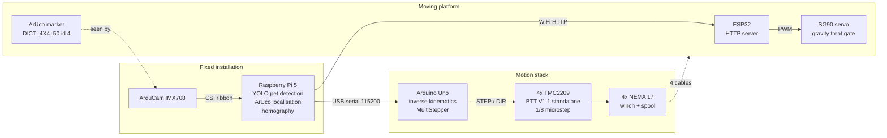

# cdpr-petbot

A cable-driven parallel robot that moves a camera-tracked platform around a pet
room and drops treats on command.

---

## Status

**In progress. Student project. Not finished, not validated, not safe to leave
unattended.**

What works today:

- Four winches driven as a coordinated group; the platform moves in a straight
  line between commanded points.
- Arduino firmware accepts serial move/report/home commands and rejects targets
  outside the configured workspace.
- Pi camera pipeline runs YOLO and reports a floor-contact pixel for a detected
  pet.
- Homography tooling maps floor pixels to millimetres.

What does not work yet:

- No closed-loop position control. The steppers are open-loop and the firmware
  believes its own step count.
- Position accuracy is dominated by spool radius variation (see
  [Known limitations](#known-limitations)); the v2 drum is still in design.
- Homing is manual.
- `docs/results.md` is a skeleton. **No accuracy numbers have been measured
  yet**, so none are quoted here.
- The ESP32 treat gate runs standalone but is not yet sequenced by
  `control/mission.py` end to end.

Do not run this without the safety tether described below.

---

## How it works

Four winches sit at waist level, one per corner of the room. Each pays out a
Dyneema line that runs up to a pulley mounted at 45° in the ceiling corner
above it, then down to a shared moving platform. Cables can only *pull*, never
push, so the platform's position is set differentially: shortening two cables
and lengthening the other two drags the platform across the room, and
shortening all four together lifts it. Gravity plus the geometry of the four
anchors supplies the restoring force that a pushing actuator would otherwise
provide.

Because every cable length is a simple Euclidean distance from the platform to
its anchor, the inverse kinematics is exact and cheap enough for an Uno. The
forward direction — four measured lengths to one position — is over-constrained
and is not solved here.

```
              Y
              ^
   A2 o───────────────────o A3          o  = ceiling-corner pulley (45° mount)
      │\                 /│             W  = waist-level winch below it
      │ \               / │             P  = moving platform
      │  \             /  │
      │   \           /   │             Cable path per corner:
      │    \    P    /    │               W --(vertical run)--> o --(free span)--> P
      │     \  ╱▓╲  /     │
      │      \╱   ╲/      │             The vertical run W->o is a fixed length
      │      ╱╲   ╱╲      │             and folds into the homing offset, so the
      │     ╱  ╲ ╱  ╲     │             firmware only models o -> P.
      │    ╱    V    ╲    │
      │   ╱           ╲   │
      │  ╱             ╲  │
      │ ╱               ╲ │
   A1 o───────────────────o A4  --> X
     (origin)
      W1        W2/W3/W4 likewise directly below their own pulley
```

Origin is one floor corner. X and Y run along the two walls, Z is up. Anchor
coordinates go in `docs/kinematics.md` and must be copied into the firmware.

---

## Architecture



Plain text, same thing:

```
Pi (YOLO + ArUco)  --USB serial 115200-->  Arduino (IK + MultiStepper)
                                             --> 4x TMC2209 --> 4x NEMA 17
Pi                 --WiFi HTTP-->          ESP32 (servo treat gate)
```

---

## Repo layout

| Directory | Purpose |
|---|---|
| `docs/` | Hardware BOM and wiring, kinematics derivation, calibration procedures, build log, results tables |
| `firmware/cdpr_controller/` | Arduino Uno sketch: serial command parser, inverse kinematics, four-axis coordinated motion |
| `esp32/platform_node/` | ESP32 sketch on the moving platform: WiFi HTTP server for the treat gate and battery status |
| `vision/` | Pi-side camera pipeline: YOLO detection, homography calibration, ArUco platform tracking |
| `control/` | Host-side glue: serial wrapper for the Arduino, mission script tying vision to motion |
| `cad/` | Printed parts — spool, corner pulley housing, motor bracket, platform |
| `data/` | Datasets and saved calibration output (`data/calibration/homography.npy`) |
| `scripts/` | Provisioning, currently the Pi setup script |

---

## Quick start

### 1. Pi setup

```bash
git clone <this repo> && cd cdpr-petbot
bash scripts/setup_pi.sh
```

The script installs `python3-picamera2` and `python3-opencv` from apt, then
creates `~/cv` **with `--system-site-packages`** — those two packages are not
pip-installable on the Pi, so a sealed venv cannot see the camera. Then:

```bash
source ~/cv/bin/activate
cp vision/config.example.yaml vision/config.yaml
$EDITOR vision/config.yaml     # serial port, room dimensions, anchors, ESP32 URL
python vision/detect.py
```

### 2. Arduino flash

Install the **AccelStepper** library (Library Manager → "AccelStepper" by Mike
McCauley; it ships `MultiStepper` too). Open
`firmware/cdpr_controller/cdpr_controller.ino`, fill in the `A[4][3]` anchor
table and `steps_per_mm`, select Arduino Uno, upload.

Before powering the drivers, confirm the two hard rules in
[`docs/hardware.md`](docs/hardware.md#driver-setup): one 100 µF cap at each
driver's VM/GND pins, and every ground on one net.

### 3. First move

Attach the safety tether. Place the platform at a known point, then over the
serial monitor at 115200:

```
H 1000 1000 1200      set home: platform is at x=1000 y=1000 z=1200 mm
R                     report position
M 1200 1000 1200      move 200 mm in +X
R                     confirm
D                     disable drivers when done
```

Or from the host:

```bash
python -m control.mission --dry-run     # prints what it would send
python -m control.mission               # for real
```

---

## Measured results

See [`docs/results.md`](docs/results.md).

Every table there is currently empty. Headline accuracy numbers will be inlined
here once real measurements exist — not before.

---

## Known limitations

- **Open-loop steppers.** Skipped steps are silent. They corrupt the position
  estimate permanently, until the platform is re-homed by hand.
- **Effective spool radius changes as line layers build up.** Measured payout
  on the 15.6 mm core drum: mean **56.7 mm/rev**, range **52.4–60.3 mm/rev**
  (±3.5%). At 2 m of paid-out cable that is roughly **±70 mm** of position
  uncertainty. Mitigation in progress: redesigned 40 mm core drum plus a
  lead-in guide to force even layering.
- **Manual homing.** The operator places the platform at a known point and
  tells the firmware where it is. There are no limit switches and no absolute
  reference.
- **Anchor coordinates are measured by tape.** That error propagates directly
  and systematically into position error everywhere in the workspace — it does
  not average out.
- **Cable exit point migrates around the pulley sheave** by roughly ±15 mm as
  the platform moves. The firmware treats each anchor as a fixed point and does
  not model this.
- **Workspace is bounded by the positive-tension constraint.** Cables pull
  only, so any target where a cable would need to push is unreachable. Usable
  volume is roughly the inner 70% of the anchor footprint; the firmware
  enforces a conservative box via `WORKSPACE_MARGIN`.
- **Pulleys are mounted with 3M VHB adhesive, not mechanical fasteners.** A
  slack safety tether under the platform is required at all times.

---

## Bill of materials

See [`docs/hardware.md`](docs/hardware.md).

---

## License

MIT — see [`LICENSE`](LICENSE).

## Acknowledgements

AccelStepper / MultiStepper by Mike McCauley. Ultralytics YOLO. OpenCV ArUco.
Picamera2 by Raspberry Pi Ltd. BigTreeTech for the TMC2209 V1.1 breakout
documentation.
